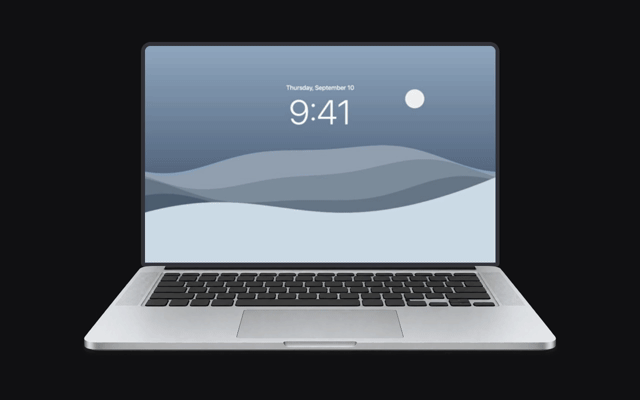

# BendMac

[](https://bendmac.app/assets/bendmac-laptop-demo.mp4)

[Download for Mac](https://github.com/IuCC123/BendMac/releases/latest/download/BendMac-macOS.dmg) · [Website](https://bendmac.app) · [Full demo](https://bendmac.app/assets/bendmac-laptop-demo.mp4)

Your desktop bends and blurs as you close your MacBook lid. BendMac runs in the menu bar and is free and open source.

Inspired by [Bendy](https://trybendy.app/) and the iPhone Duo folding animation. No affiliation with Bendy or Apple.

## Install

Requires **macOS 14+** and an **Apple silicon MacBook with a lid-angle sensor**. Tested hardware so far: M5 MacBook Air. If you try another model, please [let us know](https://github.com/IuCC123/BendMac/issues).

1. Open the DMG and drag BendMac into Applications.
2. Open BendMac and turn on **General → Enable BendMac**.
3. Grant access in **System Settings → Privacy & Security → Screen & System Audio Recording**.

BendMac isn't notarized yet. You may need to approve it in Privacy & Security the first time you open it.

## Using it

Adjust the style, blur, perspective, and shadow in Appearance. The preview works without Screen Recording permission. Lid Behavior lets you change the angle at which the effect clears or control it manually.

Press **Escape** to pause the effect. Close the settings window to leave BendMac running, or quit from the menu bar. Only the built-in display is affected.

Turn on **General → Open at login** to start BendMac with your Mac. If the effect was on when you quit, it comes back on by itself with the same Follow lid setting and manual angle. Temporary capture failures are retried; missing sensor or display readiness can recover when the device becomes available.

Use **Check for updates** to install future versions in the app. If you're on 0.4.0 or earlier, download the current version manually first.

Screen frames stay in memory. Nothing is recorded to disk or uploaded, and audio isn't captured. Update checks contact GitHub to look for new releases.

## Build from source

Open `BendMac.xcodeproj` in Xcode and run the BendMac scheme. Xcode will download Sparkle; install the Metal compiler component if prompted.

With XcodeGen installed:

```sh
./scripts/build.sh
```

The app is written to `build/Build/Products/Release/BendMac.app`. Run `./scripts/dmg.sh` to package a DMG.

`./scripts/verify.sh` checks lifecycle recovery, saved settings, idle animation timers, motion math, signature, sensor, and Metal rendering. It needs a Mac; FFmpeg is optional for exporting the preview video.

## Contributing

[Issues](https://github.com/IuCC123/BendMac/issues) and pull requests are welcome. See [CONTRIBUTING.md](CONTRIBUTING.md) for setup and [release instructions](docs/releases.md) for packaging and update signing.

The app uses SwiftUI, AppKit, ScreenCaptureKit, and Metal. The lid sensor's HID report is undocumented, so compatibility can vary. Website source is in `website/dist`.

[MIT license](LICENSE). Reference videos and Bendy's assets aren't included.
